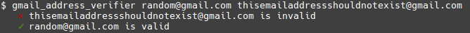

# gmail_address_verifier
Checks if a Gmail address exists. Implements a information disclosure exploit found by [@x0rz](https://twitter.com/x0rz). Read more [here](https://blog.0day.rocks/abusing-gmail-to-get-previously-unlisted-e-mail-addresses-41544b62b2).

# Usage



# Installation

```go get github.com/jakewarren/gmail_address_verifier```
